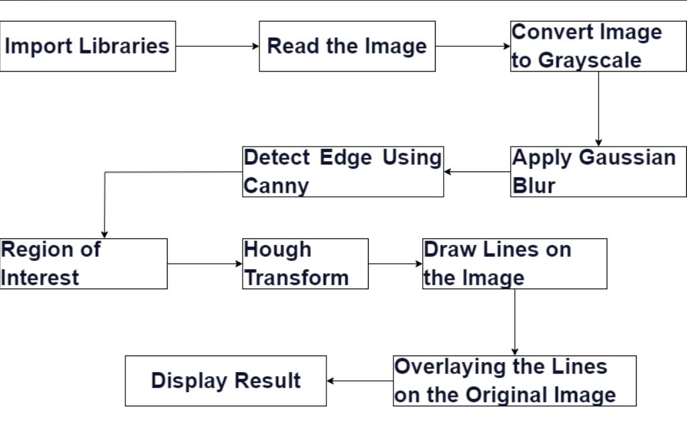
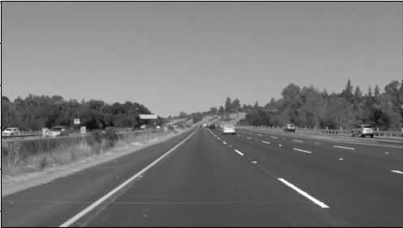
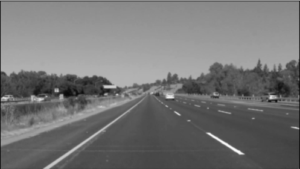
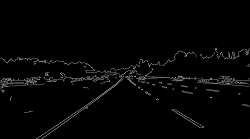
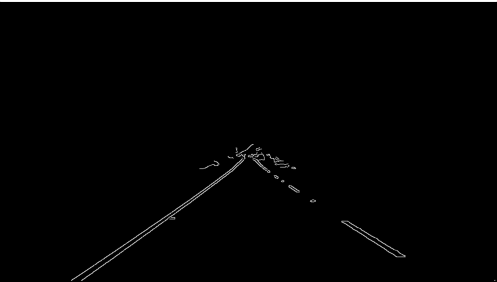
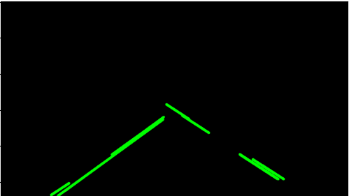
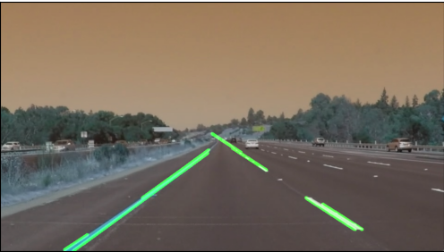

# LANE DETECTION

🦈 This is a Pull Shark test update!!

## Giới Thiệu

Dự án này tập trung vào việc phát hiện và theo dõi làn đường trong hình ảnh hoặc video sử dụng các thuật toán xử lý ảnh và máy học. Mục tiêu của dự án là cung cấp một giải pháp thông minh để nhận diện cấu trúc đường và hỗ trợ các ứng dụng liên quan đến giao thông và lái xe tự động.

## Ứng Dụng Trong Đời Sống

### 1. Hệ Thống Làm Chủ Giao Thông
- Giám sát và quản lý luồng giao thông trên các tuyến đường.
- Tối ưu hóa đèn giao thông và dòng chảy của phương tiện.

### 2. Hỗ Trợ Hành Trình và Bảo Dưỡng Xe
- Cung cấp thông tin về vị trí và tình trạng của làn đường.
- Tối ưu hóa hành trình và bảo dưỡng hệ thống lái.

### 3. An Toàn Xe Tự Lái
- Phát hiện và theo dõi làn đường để đảm bảo an toàn cho hành khách và người tham gia giao thông.
- Hỗ trợ chức năng lái tự động và tăng cường khả năng đánh lái an toàn.

### 4. Hệ Thống Cảnh Báo Lái Xe
- Cảnh báo lái xe về sự thay đổi đột ngột trong làn đường hoặc tiếp xúc không an toàn với các phương tiện khác.

### 5. Nghiên Cứu và Phát Triển Xe Tương Lai
- Hỗ trợ nghiên cứu và phát triển các công nghệ xe tự lái và ứng dụng thị giác máy tính trong lĩnh vực ô tô.

## Mô tả quy trình :



---
Sơ đồ các bước.
1. Import Libraries (Nhập thư viện): Bước này bắt đầu bằng việc nhập các thư viện và công cụ
cần thiết cho quy trình, ví dụ: OpenCV để xử lý hình ảnh và numpy để làm việc với mảng
dữ liệu.

2. Read the Image (Đọc Ảnh): Bạn đọc ảnh đầu vào (thường là ảnh từ camera hoặc video)
bằng OpenCV để tiếp tục xử lý.

3. Convert Image to Grayscale (Chuyển ảnh thành ảnh xám): Chuyển ảnh màu (ảnh RGB)
sang ảnh xám (grayscale) để giảm chi phí tính toán và tập trung vào việc phát hiện cạnh.

4. Apply Gaussian Blur (Áp dụng làm mờ Gaussian): Để giảm nhiễu và làm cho việc phát hiện
cạnh dễ dàng hơn, bạn áp dụng làm mờ Gaussian lên ảnh xám.

5. Detect Edge Using Canny (Phát hiện biên bằng Canny): Sử dụng thuật toán Canny để phát
hiện biên trong ảnh, tạo ra ảnh biên (edges) trong đó các cạnh của đối tượng được sáng lên.

6. Region of Interest (Vùng quan tâm): Bạn xác định một vùng quan tâm (Region of Interest -
ROI) trên ảnh. Vùng này thường là khu vực mà bạn mong muốn phát hiện làn đường. Các
điểm nằm ngoài ROI sẽ bị loại bỏ khỏi quá trình phát hiện.

7. Hough Transform (Biến đổi Hough): Áp dụng biến đổi Hough lên ảnh biên để tìm các đường
thẳng trong ảnh. Biến đổi Hough giúp chúng ta xác định các đường thẳng trong không gian
rho (fi) và theta (fi).

8. Draw Lines on the Image (Vẽ đường trên ảnh): Bước này dựa trên kết quả của biến đổi
Hough, chúng ta có thể tìm ra các đường thẳng trong ảnh.

9. Overlaying the Lines on the Original Image (Đè các đường lên ảnh gốc): Sau khi tìm được
các đường, chúng ta đè chúng lên ảnh gốc để hiển thị các đường đó trên hình ảnh thực tế.

10. Display Result (Hiển thị kết quả): Cuối cùng, bạn hiển thị ảnh đã xử lý với các đường làn
đã được phát hiện, thường là để theo dõi, kiểm tra hoặc làm video demo của quá trình phát
hiện làn đường.

**Lưu ý:** Đây là một mô tả tổng quan và có thể được mở rộng thêm theo yêu cầu và cụ thể của dự án.


<pre>
import cv2
import numpy as np
from moviepy.editor import VideoFileClip
</pre>

## I. Import các thư viện :
    Giải thích mỗi dòng mã:

1. **Import thư viện OpenCV:**
   ```python
   import cv2
Dòng này thực hiện việc import thư viện OpenCV (Open Source Computer Vision). OpenCV là một thư viện mã nguồn mở cung cấp các công cụ và thuật toán cho xử lý ảnh và thị giác máy tính.

2. **Import thư viện  NumPy:**
   ```python
   import numpy as np
Thực hiện việc import thư viện NumPy, một thư viện Python chuyên về tính toán số học và thực hiện các phép toán trên mảng nhiều chiều. NumPy thường được sử dụng trong xử lý dữ liệu số và thị giác máy tính.

3. **Import lớp VideoFileClip từ thư viện MoviePy:**
   ```python
   from moviepy.editor import VideoFileClip
Thực hiện việc import lớp VideoFileClip từ thư viện MoviePy. MoviePy là một thư viện được sử dụng để làm việc với video trong Python. Lớp VideoFileClip được sử dụng để tạo một đối tượng video từ một tệp video có sẵn để sau đó có thể thực hiện các xử lý và chỉnh sửa trên video đó.

## II. Hàm xử lý ảnh và thuật toán :
Ta lấy ví dụ là ảnh sau:


    Giải thích mỗi dòng mã:
Đầu tiên, chúng ta sẽ đọc hình ảnh mà chúng ta muốn phát hiện làn đường. Chúng ta sẽ sử dụng imread()chức năng của OpenCV để đọc hình ảnh.
```python
# Đọc ảnh đầu vào
image = cv2.imread('road7.jpg')
# Hiển thị ảnh
plt.imshow(cv2.cvtColor(image, cv2.COLOR_BGR2RGB))
plt.title('Input Image')
plt.show()
```
    
1. **Chuyển đổi hình ảnh sang ảnh xám:**
   ```python
   gray = cv2.cvtColor(frame, cv2.COLOR_BGR2GRAY)
Dòng mã gray = cv2.cvtColor(frame, cv2.COLOR_BGR2GRAY) sử dụng hàm cvtColor của thư viện OpenCV để chuyển đổi một hình ảnh màu từ không gian màu BGR (Blue-Green-Red) sang không gian màu độ xám.

frame: Là hình ảnh ban đầu, được giả định là ở định dạng màu BGR.

cv2.COLOR_BGR2GRAY: Là hằng số cho biết hàm cvtColor sẽ thực hiện chuyển đổi sang không gian màu độ xám. Trong trường hợp này, cv2.COLOR_BGR2GRAY chỉ định rằng hình ảnh đầu vào sẽ được chuyển đổi thành hình ảnh độ xám.

Hàm cvtColor sẽ thực hiện việc tính toán trung bình có trọng số của các giá trị màu BGR để tạo ra giá trị màu độ xám tương ứng. Kết quả của dòng mã này là một hình ảnh độ xám, giảm chiều sâu màu của hình ảnh. Điều này thường được thực hiện để đơn giản hóa việc xử lý ảnh và giảm độ phức tạp của dữ liệu.



2. **Làm mờ ảnh xám:**
   ```python
   blur = cv2.GaussianBlur(gray, (5, 5), 0)
Dòng mã blur = cv2.GaussianBlur(gray, (5, 5), 0) sử dụng hàm GaussianBlur từ thư viện OpenCV để áp dụng bộ lọc Gaussian (lọc Gauss) cho một hình ảnh xám.

Giải thích từng tham số:

gray: Là hình ảnh đầu vào đã được chuyển đổi sang thang độ xám (độ sáng).

(5, 5): Là kích thước của kernel (bộ lọc) Gaussian, được xác định bởi chiều rộng và chiều cao của kernel. Trong trường hợp này, kernel là một ma trận vuông kích thước 5x5. Kích thước của kernel ảnh hưởng đến độ mờ của hình ảnh sau khi áp dụng bộ lọc Gaussian. Kernel lớn hơn sẽ tạo ra hiệu ứng làm mờ lớn hơn.

0: Là độ lệch chuẩn (standard deviation) của Gaussian. Trong trường hợp này, giá trị 0 chỉ định rằng OpenCV sẽ tự động xác định độ lệch chuẩn dựa trên kích thước của kernel. Đối với nhiều trường hợp, việc sử dụng giá trị 0 là lựa chọn phổ biến vì nó tự động tính toán độ lệch chuẩn phù hợp.

Mục đích của dòng code:

Dòng này thực hiện việc áp dụng bộ lọc Gaussian để làm mờ hình ảnh xám. Bộ lọc Gaussian giúp giảm nhiễu trong hình ảnh và làm mờ các chi tiết không mong muốn. Việc này thường được thực hiện để chuẩn bị cho các bước xử lý tiếp theo trong quá trình xử lý ảnh, như việc phát hiện biên bằng Canny hay phát hiện đường bằng Hough.



3.**Canny Edge Detection:**

```python
edges = cv2.Canny(blur, 50, 150)
```
Dòng mã edges = cv2.Canny(blur, 50, 150) sử dụng thuật toán Canny để phát hiện biên trong hình ảnh đã được làm mờ bằng bộ lọc Gaussian. Dưới đây là giải thích chi tiết:

Giải thích từng tham số:

- blur: Là hình ảnh đã được làm mờ trước đó bằng bộ lọc Gaussian. Hình ảnh này giúp giảm nhiễu và chuẩn bị cho quá trình phát hiện biên.

- 50: Là ngưỡng dưới cho thuật toán Canny. Bất kỳ biên nào có độ gradient (độ dốc) lớn hơn ngưỡng này sẽ được coi là biên đặc trưng.

- 150: Là ngưỡng trên cho thuật toán Canny. Bất kỳ biên nào có độ gradient lớn hơn ngưỡng này sẽ được coi là biên đặc trưng. Biên với độ gradient nằm trong khoảng giữa ngưỡng dưới và ngưỡng trên sẽ được xem xét dựa trên cạnh kết nối với các điểm có độ gradient lớn.

Mục đích: Sử dụng thuật toán Canny để phát hiện các biên trong hình ảnh đã được làm mờ bằng bộ lọc Gaussian trước đó. Các tham số 50 và 150 là ngưỡng dưới và ngưỡng trên cho việc phát hiện biên.



4.**Xác định Vùng Quan Tâm (ROI - Region of Interest):**
```python
height, width = frame.shape[:2]
roi_vertices = [(0, height), (width // 2, height // 2), (width, height)]
mask_color = 255
mask = np.zeros_like(edges)
cv2.fillPoly(mask, np.array([roi_vertices], dtype=np.int32), mask_color)
masked_edges = cv2.bitwise_and(edges, mask)
```

Dòng mã trên thực hiện việc xác định vùng quan tâm (Region of Interest - ROI) trong hình ảnh bằng cách tạo một mặt nạ và áp dụng nó cho biên đã được phát hiện bởi thuật toán Canny. Dưới đây là giải thích từng tham số:

height, width = frame.shape[:2]:

Mục đích: Lấy chiều cao (height) và chiều rộng (width) của hình ảnh frame.

roi_vertices = [(0, height), (width // 2, height // 2), (width, height)]:

Mục đích: Xác định đỉnh của vùng quan tâm (ROI). Trong trường hợp này, vùng quan tâm được định nghĩa bởi ba điểm: góc trên bên trái (0, height), điểm giữa phía trên (width // 2, height // 2), và góc trên bên phải (width, height).

mask_color = 255:

Mục đích: Xác định giá trị màu sẽ được sử dụng để điền vào vùng quan tâm trên mặt nạ. Trong trường hợp này, giá trị 255 thường được sử dụng để tạo ra một mặt nạ trắng.

mask = np.zeros_like(edges):

Mục đích: Tạo một mặt nạ đen có kích thước giống với hình ảnh biên (edges). Mặt nạ này sẽ được sử dụng để chứa vùng quan tâm của hình ảnh.

cv2.fillPoly(mask, np.array([roi_vertices], dtype=np.int32), mask_color):

Mục đích: Điền vùng quan tâm được định nghĩa bởi roi_vertices vào mặt nạ với màu được xác định bởi mask_color. Trong trường hợp này, nó sẽ tạo ra một mặt nạ có dạng tam giác trắng tại vùng quan tâm.

masked_edges = cv2.bitwise_and(edges, mask):

Mục đích: Áp dụng mặt nạ đã tạo lên biên (edges). Các điểm nằm ngoài vùng quan tâm sẽ trở thành 0 (đen), trong khi các điểm nằm trong vùng quan tâm giữ nguyên giá trị của biên. Điều này giúp giảm nhiễu và tập trung xử lý chỉ vào vùng cần quan tâm.



5.**Biến đổi Hough:**
```python
lines = cv2.HoughLinesP(masked_edges, rho=6, theta=np.pi/60, threshold=160, minLineLength=40, maxLineGap=25)
```

Dòng mã lines = cv2.HoughLinesP(masked_edges, rho=6, theta=np.pi/60, threshold=160, minLineLength=40, maxLineGap=25) sử dụng biến đổi Hough để xác định các đoạn thẳng trong hình ảnh đã được xác định biên và áp dụng mặt nạ.

Dưới đây là giải thích từng tham số:

- masked_edges:
Mục đích: Hình ảnh biên đã được áp dụng mặt nạ, nơi chỉ vùng quan tâm của hình ảnh được giữ lại và các vùng khác trở thành đen.

- rho=6:
Mục đích: Đây là độ đo của đường thẳng trong không gian Hough. Giá trị 6 chỉ định rằng đường thẳng sẽ được biểu diễn trong không gian rho với mỗi đoạn 6 pixels.

- theta=np.pi/60:
Mục đích: Đây là độ đo của góc theta trong không gian Hough. Giá trị np.pi/60 chỉ định rằng các đường thẳng sẽ được biểu diễn trong không gian góc theta với mỗi góc 1 độ.

- threshold=160:
Mục đích: Ngưỡng số lượng biến đổi (pixel) cần thiết để xem xét một đường thẳng. Nếu một giá trị đường thẳng xuất hiện ít hơn ngưỡng này, nó sẽ không được xem xét.

- minLineLength=40:
Mục đích: Độ dài tối thiểu của đoạn thẳng được chấp nhận. Nếu đoạn thẳng ngắn hơn giá trị này, nó sẽ không được xem xét.

- maxLineGap=25:
Mục đích: Khoảng trắng tối đa giữa các đoạn thẳng có thể được kết hợp thành một đoạn thẳng đầy đủ. Nếu khoảng trắng giữa các đoạn thẳng lớn hơn giá trị này, chúng sẽ được xem xét là các đoạn thẳng riêng lẻ.

Mục đích tổng: Sử dụng biến đổi Hough để xác định các đoạn thẳng trong hình ảnh từ các điểm biên đã được phát hiện.

6.**Vẽ Các Đoạn Thẳng Lên Ảnh:**
```python
line_image = np.zeros_like(frame)
for line in lines:
    x1, y1, x2, y2 = line[0]
    cv2.line(line_image, (x1, y1), (x2, y2), (0, 255, 0), 5)
```
Dòng mã trên được sử dụng để vẽ các đoạn thẳng đã được xác định bởi biến đổi Hough lên một ảnh trắng. Dưới đây là giải thích từng tham số trong đoạn mã:

- line_image = np.zeros_like(frame):
Mục đích: Tạo một ảnh trắng có kích thước giống với hình ảnh gốc (frame). Điều này sẽ làm nền cho việc vẽ các đoạn thẳng.

- for line in lines:
Mục đích: Lặp qua danh sách các đoạn thẳng đã được xác định bởi biến đổi Hough.

- x1, y1, x2, y2 = line[0]:
Mục đích: Lấy các tọa độ của hai điểm cuối của đoạn thẳng từ danh sách các đoạn thẳng.

- cv2.line(line_image, (x1, y1), (x2, y2), (0, 255, 0), 5):
Mục đích: Vẽ đoạn thẳng lên ảnh trắng. Cụ thể:

-- line_image: Là ảnh trắng sẽ chứa đoạn thẳng được vẽ.
(x1, y1), (x2, y2): Là hai điểm cuối của đoạn thẳng.

-- (0, 255, 0): Là màu của đoạn thẳng. Trong trường hợp này, màu là (0, 255, 0) tương ứng với màu xanh lá cây (green).
-- 5: Là độ dày của đoạn thẳng được vẽ.

Kết quả của đoạn mã này là ảnh line_image chứa các đoạn thẳng được vẽ lên một nền trắng, và nó sẽ được sử dụng để xếp chồng lên ảnh gốc sau đó để tạo ra hình ảnh cuối cùng có đường thẳng đã được vẽ.

Mục đích tổng : Vẽ các đoạn thẳng đã được xác định bởi biến đổi Hough lên một ảnh trắng.



7.**Xếp Chồng Các Dòng Trên Ảnh Gốc:**
```python
final_image = cv2.addWeighted(frame, 0.8, line_image, 1, 0)
```
Dòng mã final_image = cv2.addWeighted(frame, 0.8, line_image, 1, 0) sử dụng hàm cv2.addWeighted để kết hợp hai ảnh lại với nhau và tạo ra hình ảnh cuối cùng. Dưới đây là giải thích từng tham số:

- frame:
Mục đích: Là ảnh gốc, chứa nền và các chi tiết không phải đoạn thẳng.

- 0.8:
Mục đích: Là trọng số của ảnh gốc (frame) trong quá trình kết hợp. Trong trường hợp này, ảnh gốc chiếm 80% trong quá trình xếp chồng.

- line_image:
Mục đích: Là ảnh chứa các đoạn thẳng đã được vẽ lên nền trắng.

- 1:
Mục đích: Là trọng số của ảnh chứa các đoạn thẳng (line_image) trong quá trình kết hợp. Trong trường hợp này, ảnh chứa các đoạn thẳng chiếm 100% trong quá trình xếp chồng.
- 0:
Mục đích: Là đại lượng được thêm vào sau khi kết hợp cả hai ảnh. Trong trường hợp này, không có đại lượng nào được thêm vào.
  
- Tổng quan về hàm cv2.addWeighted:
Hàm này thực hiện việc kết hợp hai ảnh với nhau dựa trên trọng số đã chỉ định. Kết quả là một ảnh mới, trong đó ảnh gốc và ảnh được vẽ các đoạn thẳng được kết hợp lại với nhau. Thông qua việc điều chỉnh trọng số, bạn có thể kiểm soát độ sáng và độ tương phản của ảnh kết hợp.

Mục đích: Kết hợp ảnh gốc với ảnh chứa các đoạn thẳng đã được vẽ để tạo ra hình ảnh cuối cùng. cv2.addWeighted thực hiện việc xếp chồng ảnh gốc và ảnh chứa đoạn thẳng với trọng số được chỉ định (0.8 và 1 trong trường hợp này).



## III. Áp dụng kết quả thuật toán vào video :
```python
def process_video(input_path, output_path):
    clip = VideoFileClip(input_path)
    processed_clip = clip.fl_image(process_frame)
    processed_clip.write_videofile(output_path, audio=False)

# Thay đổi tên video đầu vào và tên video đầu ra ở đây
input_video_path = 'test2.mp4'
output_video_path = 'D:/daura.mp4'

# Gọi hàm xử lý video và tạo video đầu ra
process_video(input_video_path, output_video_path)
```
Dòng mã trên định nghĩa một hàm process_video để xử lý video từ đầu vào và tạo ra video đầu ra sau khi được xử lý bởi hàm process_frame. Dưới đây là giải thích từng dòng mã:

- def process_video(input_path, output_path):
Mục đích: Định nghĩa hàm process_video với hai tham số là input_path (đường dẫn đến video đầu vào) và output_path (đường dẫn đến video đầu ra).

- clip = VideoFileClip(input_path):
Mục đích: Sử dụng thư viện MoviePy để tải video từ đường dẫn input_path và tạo một đối tượng video clip.

- processed_clip = clip.fl_image(process_frame):
Mục đích: Áp dụng hàm process_frame lên mỗi khung hình của video clip để xử lý video.

- processed_clip.write_videofile(output_path, audio=False):
Mục đích: Ghi video đã được xử lý vào đường dẫn output_path. Tham số audio=False được sử dụng để chỉ định rằng video mới không chứa thông tin âm thanh (nếu có).

- input_video_path = 'test2.mp4' và output_video_path = 'D:/daura.mp4':
Mục đích: Định nghĩa đường dẫn đến video đầu vào và đường dẫn đến video đầu ra.

- process_video(input_video_path, output_video_path):
Mục đích: Gọi hàm process_video để xử lý video từ đường dẫn input_video_path và tạo video đầu ra tại đường dẫn output_video_path.


   


